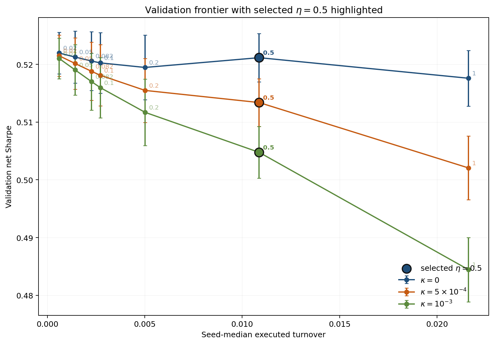

# Execution-Aware Portfolio Reinforcement Learning
## Target, Execution, and Accounting as Separate Objects

This repository studies portfolio control with a simple but strict distinction:

- `w_tgt`: the portfolio the controller proposes
- `w_exec`: the portfolio that is actually realized

The execution layer maps target weights to realized holdings through a partial-adjustment rule,

```text
w_exec,t = (1 - eta_t) w_exec,t-1 + eta_t w_tgt,t,
```

and the paper evaluates performance on the executed path rather than on the untraded target path.

## Why This Matters

Many portfolio-RL pipelines implicitly treat

```text
w_tgt = w_exec
```

as if it were an identity. This repository treats that as a modeling choice instead.

The paper asks a narrower question:

- if the learned target path is held fixed,
- and only the execution rule changes,
- does realized net performance change once trading frictions are charged on what is actually traded?

## Where To Look First

- [`prl-dow30/`](prl-dow30): active source tree for training, evaluation, and experiment scripts
- [`frozen_protocol/`](frozen_protocol): locked protocol snapshots and split definitions used by the paper
- [`repro/`](repro): manifests, rebuild artifacts, smoke checks, and paper-facing reproduction material

## Current Paper Scope

The paper is an execution-and-accounting identification study built around a fixed 27-name large-cap U.S. equity snapshot.

- canonical splits: `2010--2021`, `2022--2023`, `2024--2025`
- locked execution grid: `eta in {1.0, 0.5, 0.2, 0.1, 0.082, 0.05, 0.02}`
- validation-selected operating point on the canonical split: `eta = 0.5`

Main empirical takeaway on the canonical split:

- executed turnover falls from `0.02200` to `0.01095`
- paired median net Sharpe improves by `+0.0105` at `kappa = 5e-4`
- paired median net Sharpe improves by `+0.0213` at `kappa = 1e-3`
- the `kappa = 0` row remains nearly flat

The manuscript now also includes:

- an `eta`-aligned retraining check
- a second 36-name large-cap replication benchmark
- a cost-calibrated linear-convex information-parity comparator

## Representative Frontier

<p align="center">
  
</p>

The main frontier should be read as follows:

- when `kappa = 0`, the selected interior point is nearly flat relative to immediate execution
- when `kappa > 0`, an interior execution rate improves net Sharpe by reducing realized turnover
- the paper's main claim is therefore about implementation under frictions, not about new alpha

## Quickstart

Install:

```bash
cd prl-dow30
pip install -r requirements.txt
```

Train:

```bash
python3 -m scripts.run_train --config configs/default.yaml --model-type prl --seed 0
```

Evaluate:

```bash
python3 -m scripts.run_eval --config configs/default.yaml --model-type prl --seed 0
```

Run experiment suites:

```bash
python3 -m scripts.run_matrix --config configs/main_experiment.yaml
python3 -m scripts.run_matrix --config configs/eta_sweep.yaml
python3 -m scripts.run_matrix --config configs/rule_vol.yaml
```

## Repository Layout

```text
paper/            final manuscript package
prl-dow30/        code, configs, scripts, experiment outputs
frozen_protocol/  locked paper protocol snapshots
repro/            manifests, rebuilds, smoke checks, and paper reproduction artifacts
docs/             project notes and specifications
defence/          defense material
```


