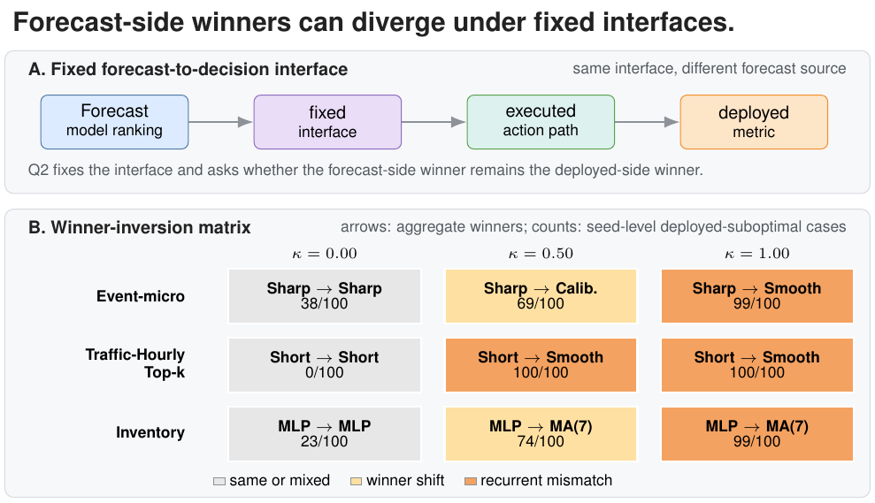

# Offline-to-Deployed Selection Transfer Audit

Manuscript artifacts and audit code for **Auditing Offline-to-Deployed Selection Transfer under Fixed Decision Interfaces**.

This project asks a pre-deployment model-selection question: if an offline validation score selects a model, does that model remain the deployed-utility winner after every candidate is passed through the same fixed decision interface and friction model?

<p align="center">
  
</p>

## What This Audits

Offline pipelines usually rank candidates by a validation score computed on collected data. Deployment often adds a fixed forecast-to-decision interface before utility is measured:

- threshold alerts
- hysteresis rules
- budgeted top-k actions
- residual-warning screens
- replenishment rules

The audit checks whether offline selection transfers through that interface. It is not a replacement for forecast-side validation, and it is not a universal deployed metric. It is a report-card layer for cases where offline validation is being used as deployment-facing model-selection advice.

## Report Card

For each task, interface, and friction level, the report card records:

- offline-selected model
- deployed-utility winner
- agreement or transfer rate
- deployed-suboptimal share/count
- paired deployed-utility shortfall
- tie and uncertainty diagnostics

Selection transfer is preserved when the offline-selected model and deployed-utility winner agree. A positive deployed shortfall means the offline-selected model is deployed-suboptimal under the specified interface and friction model.

## Audit Snapshot

| Task | Interface | Friction | Offline-selected | Deployed winner | Transfer | Suboptimal cases |
| --- | --- | ---: | --- | --- | ---: | ---: |
| Synthetic | zero-friction anchor | 0.00 | Naive last | Naive last | 1.00 | 0/20 |
| Event warning | threshold tau=0.55 | 0.50 | Reactive sharp | Calibrated | 0.31 | 69/100 |
| Event warning | threshold tau=0.55 | 1.00 | Reactive sharp | Smoother | 0.01 | 99/100 |
| Budgeted traffic alert | budget k=249 | 0.50 | Reactive short | Smoother | 0.00 | 100/100 |
| Budgeted traffic alert | budget k=249 | 1.00 | Reactive short | Smoother | 0.00 | 100/100 |
| PM2.5 warning | residual warning | 1.00 | Reactive lag-1 | Long smoother | 0.00 | 720/825 |
| Inventory replenishment | replenishment | 1.00 | Small MLP | MA(7) | 0.01 | 99/100 |

Event warning and Traffic-Hourly provide the main prediction-to-decision evidence. PM2.5 and inventory are retained as residual and operational support.

## Rebuild

Selected paper-facing figures and tables:

```bash
python paper/forecasting_workshop/results/build_v2_main_figures.py
python scripts/forecast_eval/build_workshop_freeze_and_uncertainty.py
```

Manuscript:

```bash
cd paper/forecasting_workshop
latexmk -pdf paper_forecasting_workshop_v2.tex
```

The rebuild scripts assume a Python scientific stack including `pandas` and `matplotlib`; manuscript and PDF-figure generation require a LaTeX installation.

## Scope

The audit is a reporting diagnostic, not a new benchmark suite or forecasting model. Deployed utility is interface-specific, simulator-specific, and friction-specific. The intended use is to make selection-transfer failures visible before deployment, online evaluation, or adaptation.
